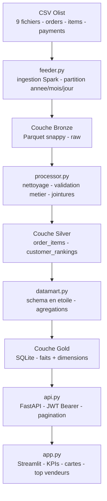

# Projet Data Engineering M1 - Architecture Medaillon Olist

[](https://github.com/Adam-Blf/projet-dataeng-m1/releases)

<!-- adam-badges:start -->
[](https://github.com/Adam-Blf/projet-dataeng-m1/commits) [](https://hits.sh/github.com/Adam-Blf/projet-dataeng-m1/) [](https://github.com/Adam-Blf/projet-dataeng-m1/commits) [](https://github.com/Adam-Blf/projet-dataeng-m1) [](LICENSE)
<!-- adam-badges:end -->


Plateforme data complete sur le jeu de donnees e-commerce Olist (Brazilian Marketplace) construite selon l'architecture Medaillon Bronze / Silver / Gold avec Apache Spark. Livrable binome du cours Data Engineering EFREI M1.

## Probleme resolu

Construire un pipeline end-to-end de qualite production sur 9 fichiers CSV Olist (orders, customers, items, payments, reviews, products, sellers, geolocation, categories) - ingestion, transformation, datamart, API securisee et dashboard.

## Equipe

- **Adam Beloucif** - [@Adam-Blf](https://github.com/Adam-Blf)
- **Emilien Morice** - [@emilien754](https://github.com/emilien754)

## Architecture



## Methode

1. **Ingestion (Bronze)** - `feeder.py` lit les CSV et les reecrit en Parquet snappy partitionne par annee / mois sur la date de commande
2. **Transformation (Silver)** - `processor.py` applique les regles metier (statuts de commande, coherence des dates, deduplication) et materialise les jointures orders x items x payments x reviews
3. **Datamart (Gold)** - `datamart.py` produit le schema en etoile (fait_commandes + dim_client / dim_produit / dim_date / dim_vendeur) et l'exporte en SQLite pour consommation legere
4. **API (api.py)** - FastAPI expose les tables Gold avec authentification Bearer JWT, pagination offset / limit, et schema OpenAPI auto
5. **Visualisation (app.py)** - dashboard Streamlit consomme l'API, affiche KPIs de performance commerciale, cartes geo, top vendeurs et distribution des notes

## Stack

- **Langage** - Python 3.10+
- **Compute** - Apache Spark 3.5 (PySpark)
- **Storage** - Parquet (Bronze / Silver), SQLite (Gold)
- **API** - FastAPI, uvicorn, python-jose (JWT)
- **Front** - Streamlit
- **Data source** - [Olist Brazilian E-Commerce Public Dataset](https://www.kaggle.com/datasets/olistbr/brazilian-ecommerce)

## Reproduction

```bash
git clone https://github.com/Adam-Blf/projet-dataeng-m1
cd projet-dataeng-m1
pip install -r requirements.txt

# 1. Telecharger le dataset Olist dans ./data/raw/

# 2. Ingestion Bronze
python feeder.py

# 3. Transformation Silver
python processor.py

# 4. Datamart Gold
python datamart.py

# 5. API (port 8000)
uvicorn api:app --reload

# 6. Dashboard (port 8501)
streamlit run app.py
```

## Licence

MIT

---

<p align="center">
  <sub>Par <a href="https://adam.beloucif.com">Adam Beloucif</a> - Data Engineer & Fullstack Developer - <a href="https://github.com/Adam-Blf">GitHub</a> - <a href="https://www.linkedin.com/in/adambeloucif/">LinkedIn</a></sub>
</p>

 <picture>
 </picture>
</a>
